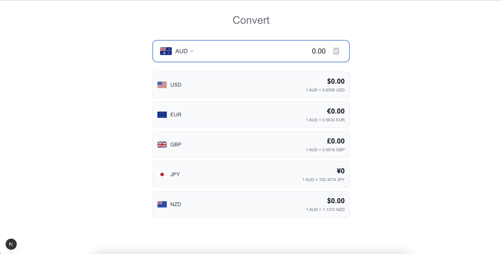
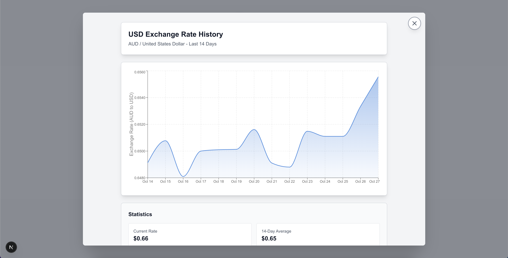

# AUD Currency Converter

A simple, modern web app that converts Australian Dollars (AUD) into five major currencies. It shows live exchange rates and 14-day historical trends.

## Features

* **Live Conversion:** Instantly convert AUD to USD, EUR, GBP, JPY, and NZD
* **Auto Updates:** Conversion results change as you type
* **14-Day Charts:** See how each currency’s value has changed over time
* **Mobile Friendly:** Works well on both computers and phones
* **Easy Setup:** Run locally or with Docker
* **Tested for Reliability:** Includes tests for core functions

## Built With

* **Next.js 16** – Website framework
* **TypeScript** – Safer, more reliable code
* **React 18** – Modern UI framework
* **Tailwind CSS** – Fast, clean styling
* **Recharts** – Charts for currency trends
* **Open Exchange Rates API** – Live exchange rate data
* **Docker** – Optional container setup
* **Jest + React Testing Library** – Automated tests

## 📸 Screenshots

| Homepage                            | Modal                             |
| ----------------------------------- | --------------------------------- |
|  |  |

## Demo

👉 [Try it here](currency-convertor-gerome.vercel.app)

---

### Run Locally

1. **Clone this project**

   ```bash
   git clone https://github.com/Gerome-Elassaad/currency-convertor
   cd currency-convertor
   ```

2. **Install the required packages**

   ```bash
   npm install
   ```

3. **Add your API key**

   ```bash
   cp .env.local.example .env.local
   ```

   Then open `.env.local` and add:

   ```
   OPEN_EXCHANGE_RATES_API_KEY=your_api_key_here
   ```

4. **Start the app**

   ```bash
   npm run dev
   ```

5. **Open it in your browser**
   [http://localhost:3000](http://localhost:3000)

---

### Run with Docker

1. **Build the Docker image**

   ```bash
   docker build -t currency-converter .
   ```

2. **Start the container**

   ```bash
   docker run -p 3000:3000 -e OPEN_EXCHANGE_RATES_API_KEY=your_key_here currency-converter
   ```

3. **Or use Docker Compose (recommended)**

   ```bash
   docker-compose up -d
   ```

Then open [http://localhost:3000](http://localhost:3000)

---

## How to Use

1. Type an amount in **AUD**

2. Instantly see the value in:

   * USD (US Dollar)
   * EUR (Euro)
   * GBP (British Pound)
   * JPY (Japanese Yen)
   * NZD (New Zealand Dollar)

3. Click on any currency to see its **14-day history** with:

   * Current rate
   * 14-day average
   * Highest and lowest rates (with dates)
   * Percentage change over time

---

## Running Tests

```bash
npm test            # Run all tests
npm run test:watch  # Run tests automatically when files change
npm run test:coverage  # See test coverage
```

Tests include:

* Core calculations
* Display components
* Error and edge case handling

---

## Folder Overview

```
currency-convertor/
├── app/                  # Main app files
│   ├── api/              # API routes
│   ├── chart/[currency]/ # Chart pages
│   ├── layout.tsx        # Main layout
│   ├── page.tsx          # Home page
│   └── globals.css       # Styles
├── components/            # UI components
├── lib/                   # Utility functions
├── types/                 # TypeScript types
├── __tests__/             # Test files
├── public/                # Images and assets
├── Dockerfile             # Docker config
├── docker-compose.yml     # Docker setup
└── README.md              # This file
```

---

## API Info

* **Source:** [Open Exchange Rates](https://openexchangerates.org)
* **Base Currency:** USD (converted to AUD in-app)
* **Refresh Rate:** Real-time
* **History:** Past 14 days
* **Free Tier Limit:** 1,000 requests per month

---

## Common Commands

```bash
npm run dev          # Start in development mode
npm run build        # Build for production
npm start            # Run production build
npm run lint         # Check for issues
npm test             # Run all tests
```

---

## Docker Commands

```bash
docker build -t currency-converter .   # Build image
docker run -p 3000:3000 -e OPEN_EXCHANGE_RATES_API_KEY=your_key currency-converter  # Run container
docker-compose up -d                   # Start with Compose
docker-compose down                    # Stop containers
```

```bash
docker pull ghcr.io/gerome-elassaad/currency-convertor:latest
docker run -p 3000:3000 -e OPEN_EXCHANGE_RATES_API_KEY=your_key ghcr.io/gerome-elassaad/currency-convertor:latest
```
